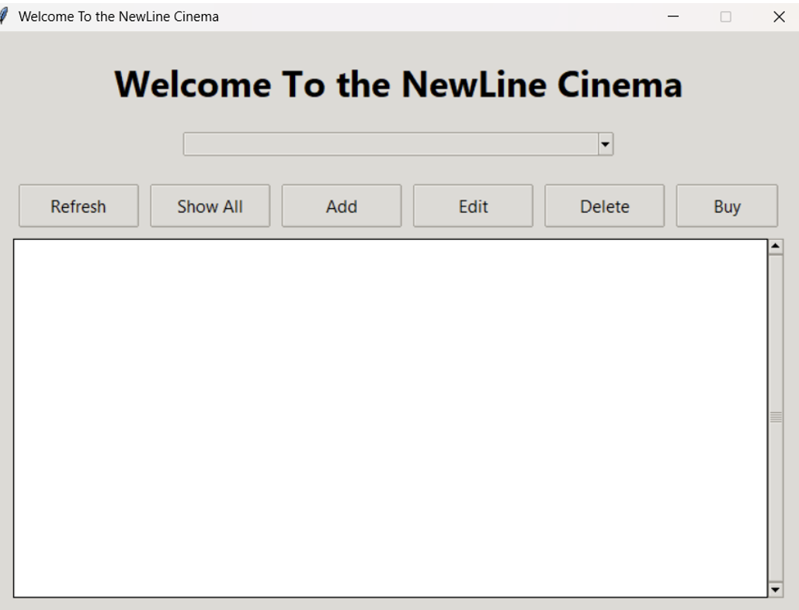
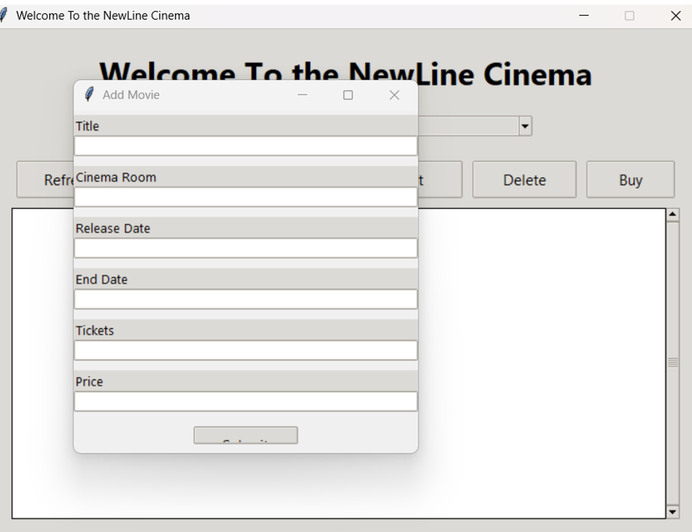

# NewLine Cinema — Client-Server Booking System

A Python client-server application for managing cinema ticket bookings, built using raw TCP sockets, SQLite, and a Tkinter GUI.

## Overview

The server handles multiple client connections concurrently using threading, and communicates with clients over sockets using JSON-encoded requests and responses. All movie and sales data is stored in a local SQLite database.

## Features

- View all currently listed movies
- Add, edit, and delete movie listings
- Purchase tickets, with automatic stock and total price calculation
- Sales are recorded and linked to the corresponding movie
- Multi-client support via threaded connection handling
- Desktop GUI built with Tkinter (dropdown selection, forms, live movie listing)

## Screenshots

**Main Client Window**

Main application window with movie selection dropdown and controls to refresh, view, add, edit, delete, and buy tickets.

**Add Movie Form**

Form for adding a new movie listing, capturing title, cinema room, release and end dates, ticket count, and price.

## Tech Stack

- **Language:** Python
- **Networking:** `socket` (TCP)
- **Database:** SQLite3
- **GUI:** Tkinter (ttk)
- **Data format:** JSON

## Getting Started

1. Initialise the database:
```
   python init_db.py
```
2. Start the server:
```
   python server.py
```
3. In a separate terminal, run the client:
```
   python client.py
```

## How It Works

The client sends action-based requests (e.g. `get_movies`, `add_movie`, `buy_ticket`) to the server as JSON over a socket connection. The server processes each request against the SQLite database and returns a JSON response indicating success or failure, along with any relevant data.

## Notes

This project was built to demonstrate socket-based client-server architecture, database integration, and GUI development in Python.
## Notes

This project was built to demonstrate socket-based client-server architecture, database integration, and GUI development in Python.
